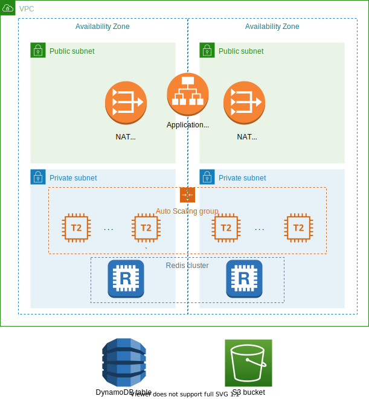

# Введение
## О проекте
Целью текущего проекта является развертывание приложения в отказоустойчивой масштабируемой инфраструктуре на платформе Amazon Web Services. В вашем распоряжении имеется ограниченный набор сервисов, который включается в себя:
* EC2
* ECS
* DynamoDB
* ElastiCache \ memcache
* S3
* VPC
* ELB

Вышеуказанный перечень сервисов является достаточным для выполнения задания, однако нет необходимости использовать все сервисы одновременно.
Все необходимые роли преднастроены, конфигурация IAM не требуется.
## Описание приложения

Приложение представляется из себя небольшой веб-север. При необходимости переменные можете задать в файле config.yml, такие как имя таблицы, путь до кластера Redis. Для проверки работоспособности приложения можете использовать страницу /status.

Для оценки здоровья сервера другими сервисами можете использовать страницу /health.
## Базовое состояние 

Вам предоставлена учетная запись IAM для доступа AWS Management Console. Так же вам предоставлен доступ к Request Dashboard, в котором вам будет необходимо указать точку входа в развернутое приложение в формате `http://[IP адрес]:[порт]` или `http://[FQDN]:[порт]`. Вам необходимо будет залогиниться через Azure. Задание и учетные данные для AWS console расположены в дашборде.  

# Техническое задание
## VPC
Инфраструктура должна быть расположена в отдельном VPC. Определите адресацию и размер подсетей по своему усмотрению. Ограничьтесь двумя AZ.
## S3
Дистрибутив приложения может быть расположен в отдельном S3 bucket.
## Load balancer
Для пользователей из сети интернет сервис должен быть доступен по протоколу HTTP на порту 80. Внутри инфраструктуры application load balancer должен быть направлен на порт 8080.

Используйте страницу /health для проверки состояния веб-сервера.
## Auto scaling
Группа должна иметь следующие параметры:
* Min instances: 1
* Max: 4
* Desired: 1
* Scaling Policy: target
  * Responses per instance: 20
  * Warm: 120sec
  * Cooldown: 120 sec

Убедитесь, что приложение запускается корректно
## DynamoDB
Создайте таблицу DynamoDB. Таблица должна содержать в качестве PrimaryKey только `PartitionKey` (без SortKey). PartitionKey должен иметь тип `string`. Укажите имя вашей таблицы и ключа в конфигурационном файле приложения (config.yml).
## Redis
Кластер должен быть развернут со следующими параметрами:
* Размер кластера: **2 узла**
* Размер инстанса: `t2.micro`
* subnetGroup должна охватывать обе зоны доступности

Укажите адрес и порт развернутого кластера в конфигурационном файле приложения (config.yml).
# Архитектура
На диаграмме представлена референсная архитектура создаваемой вами инфраструктуры. Ваше решение может отличаться, однако оно должно отвечать следующим требованиям:
* приложение должно быть **отказоустойчивым** на уровне региона (**EU Central 1 Frankfurt**);
* инфраструктура должна **автоматически масштабироваться** в зависимости от количества запросов на каждый инстанс/контейнер;
* предпочитаемый размер инстанса приложения / кластера контейнеров должен быть `t2.micro`;

